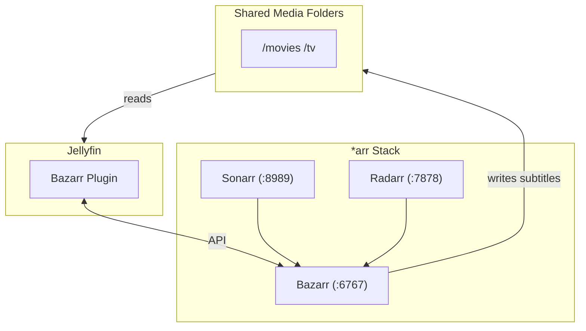
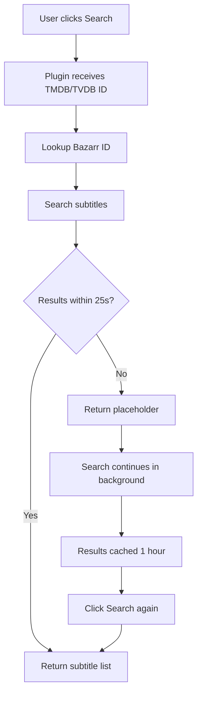
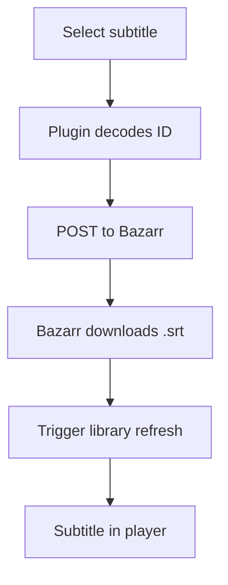

# Jellyfin Bazarr Plugin

[](https://github.com/enoch85/bazarr-jellyfin/releases)
[](LICENSE)

Search and download subtitles directly from Jellyfin using your Bazarr instance.

## Overview

This plugin integrates Jellyfin with [Bazarr](https://www.bazarr.media/) to provide on-demand subtitle searching and downloading. Instead of navigating to Bazarr's web UI, users can search and download subtitles directly from Jellyfin's native subtitle interface.

## Features

- Native Integration - Uses Jellyfin's built-in subtitle search UI
- Movies & Episodes - Full support for both content types
- Smart Caching - Results cached for 1 hour to avoid repeated searches
- Background Search - Long searches continue in background, UI stays responsive
- One-Click Download - Select and download subtitles instantly
- Auto-Refresh - Library automatically refreshes after download

## Architecture

### Data Flow



### Search & Download Flow

<div style="display: grid; grid-template-columns: 1fr 1fr; gap: 20px;">

**Search Flow**



**Download Flow**



</div>

## Installation

**From Repository (Recommended)**

1. Go to **Dashboard → Plugins → Repositories**
2. Add: `https://raw.githubusercontent.com/enoch85/bazarr-jellyfin/main/manifest.json`
3. Install "Bazarr" from Catalog
4. Restart Jellyfin

**Manual Installation**

1. Download latest release from [GitHub Releases](https://github.com/enoch85/bazarr-jellyfin/releases)
2. Extract to plugins directory:
   - Linux: `~/.local/share/jellyfin/plugins/Bazarr/`
   - Docker: `/config/plugins/Bazarr/`
   - Windows: `%AppData%\Jellyfin\plugins\Bazarr\`
3. Restart Jellyfin

## Configuration

Navigate to **Dashboard → Plugins → Bazarr**:

| Setting | Description |
|---------|-------------|
| **Bazarr URL** | Your Bazarr instance URL (e.g., `http://localhost:6767`) |
| **Bazarr API Key** | API key from Bazarr Settings → General |
| **Enable for Movies** | Allow subtitle search for movies |
| **Enable for Episodes** | Allow subtitle search for TV episodes |
| **Search Timeout** | UI timeout before showing placeholder (default: 25s). Search continues in background. |

Click **Test Connection** to verify your settings.

## Development

### Prerequisites

- .NET 9.0 SDK
- Jellyfin Server 10.10+ for testing

### Building

```bash
git clone https://github.com/enoch85/bazarr-jellyfin.git
cd bazarr-jellyfin
dotnet build
```

### Testing

```bash
dotnet test
```

### Release Process

```bash
git tag -a v1.x.x -m "Description" && git push origin v1.x.x
```

The GitHub Actions workflow automatically builds and publishes the release.

## Troubleshooting

### Subtitle search shows "Search in progress"

This is normal - Bazarr is querying multiple providers which takes time. Wait 5-15 minutes and click Search again to see cached results.

### Downloaded subtitle doesn't appear

The plugin triggers a library refresh after download. If it still doesn't appear:
1. Manually refresh the item in Jellyfin
2. Check that Bazarr successfully downloaded the file to the media folder

### Movie/Episode not found in Bazarr

Ensure the item exists in Radarr/Sonarr and Bazarr has synced. The plugin matches by TMDB ID (movies) or TVDB ID (episodes).

## License

[GPLv3](LICENSE)

## Contributing

Contributions welcome! Please open an issue or PR on [GitHub](https://github.com/enoch85/bazarr-jellyfin).
